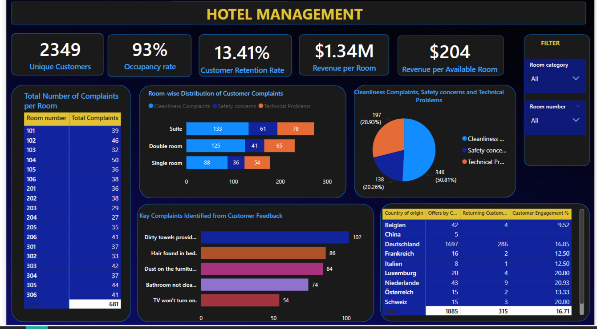

# 🏨 Hotel Management Dashboard – Power BI Project

This Power BI project presents an interactive and insightful dashboard for analyzing hotel operations and customer experiences. It focuses on customer complaints, room occupancy, revenue generation, and engagement by country of origin, allowing management to make data-driven decisions.

---

## 🧩 Problem Statement

The objective of this project is to gain actionable insights into hotel performance, customer satisfaction, and room-level issues. The analysis answers several business-critical questions, such as:

- What is the total number of unique customers?
- How many complaints are reported per room and their types?
- What are the key issues guests face based on feedback?
- What are the occupancy and retention rates?
- Which countries contribute the most to engagement and bookings?
- How is the revenue distributed across rooms?

---

## 📌 KPIs Tracked

- **Unique Customers** – Total number of different customers served.
- **Occupancy Rate** – Percentage of rooms occupied.
- **Customer Retention Rate** – Share of returning guests.
- **Revenue per Room** – Total revenue generated by room category.
- **Revenue per Available Room (RevPAR)** – Performance metric combining occupancy and revenue.
- **Total Complaints** – Overall number of complaints received across all rooms.

---

## 📊 Visualizations

| Visualization                                     | Type            | Purpose                                                                 |
|--------------------------------------------------|-----------------|-------------------------------------------------------------------------|
| Total Number of Complaints per Room              | Table           | Displays room-wise complaint count.                                    |
| Room-wise Distribution of Complaints             | Stacked Bar     | Shows cleanliness, safety, and technical complaints by room category.  |
| Complaint Types Distribution                     | Pie Chart       | Percentage of different complaint types.                               |
| Key Complaints Identified from Feedback          | Horizontal Bar  | Highlights most common customer complaints.                            |
| Country of Origin vs Engagement & Offers         | Matrix Table    | Tracks country-wise offers, returning customers, and engagement %.     |

---

## 🔧 Features & Tools Used

- **Power BI Desktop**
- **Excel (.xlsx)** as the data source
- **Power Query** for data shaping (merging, filtering, and transforming)
- **Data Modeling** with multiple tables and relationships
- **DAX Functions**:
  - `COUNTROWS`, `DISTINCTCOUNT`
  - `CALCULATE`
  - `DIVIDE`, `SUMX`, `FILTER`
- **Visual Filters** for Room Category & Room Number
- **Custom Tooltips and Interactivity**
- **Dark Theme UI** for professional visualization aesthetics

---

## 🧠 Business Insights Derived

- Suite rooms receive the highest number of complaints, particularly regarding cleanliness.
- Dirty towels and hair in bed are top feedback issues, indicating housekeeping inefficiencies.
- Room 104 has the highest total number of complaints.
- Deutschland contributes the most offers and returning customers, but Luxemburg and Schweiz have the highest customer engagement %.
- Cleanliness issues form over 50% of all complaints, signaling a need for quality control.

---

## 📁 Files Included

- `Hotel_management_dashboard_pic.png` – Visual snapshot of the final Power BI dashboard
- `Hotel_management_update_file.xlsx` – Raw dataset used for analysis
- `Question Paper (Hotel Management).pdf` – List of analytical business questions addressed

---

## 🛠 Future Improvements

- Implement time-based filters for monthly/quarterly trend tracking.
- Include room pricing and booking source data for more revenue insights.
- Use sentiment analysis on customer reviews for qualitative feedback integration.

---

